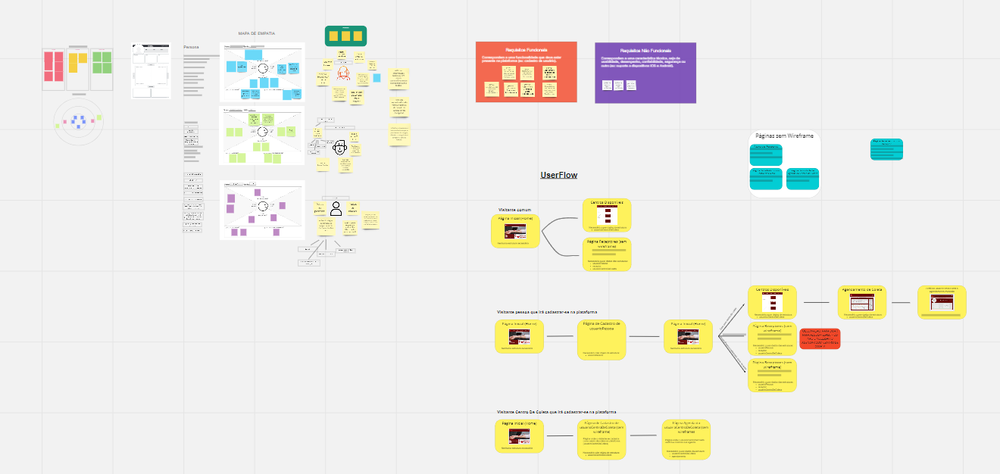

# Metadologia

## Relações de trabalho

- Usamos três ambientes de trabalho na qual desenvolvemos o projeto proposto.

|AMBIENTE | PLATAFORMA | LINK DE ACESSO  |
|--------------------|------------------------------------|----------------------------------------|
|`Repositório de código fonte`  | GITHUB | https://github.com/ICEI-PUC-Minas-PMGCC-TI/tiaw-pmg-cc-m-20212-doacao-de-sangue |
|`Projeto de Interface e Wireframes` | FIGMA | https://www.figma.com/file/4ffq1mb2qRNtL5FlDXU6kJ/Protótipo-Doação-Sangue?node-id=0%3A1 |
|`Gerenciamento de Projeto`  | MIRO | https://miro.com/app/board/o9J_ly2ceXE=/  |

## Gerenciamento do Projeto

A equipe utiliza metodologias ágeis, tendo escolhido o Design Thinking como base para definição do processo de desenvolvimento.

#### Equipe de Desenvolvimento:

- Bernardo Souza (Desenvolvedor Front End,Back End)
- Daniel Silveira (Desenvolvedor Front End,Back End)
- Leonardo Brandão (Desenvolvedor Front End,Back End)

Para organização e distribuição das tarefas do projeto, a equipe está utilizando o Miro estruturado com as seguintes listas: 

- Matriz: é uma ferramenta estratégica de definição de certezas, Suposições e Dúvidas acerca do projeto.
- Mapa Stakeholders: é uma forma de conhecer todas as partes interessadas do projeto.
- Persona: é um personagem fictício que representa o cliente ideal do nosso Projeto.
- Requisitos funcionais e não funcionais.

>