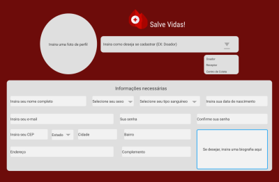
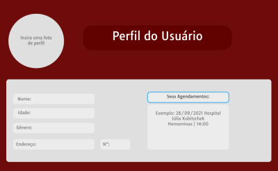
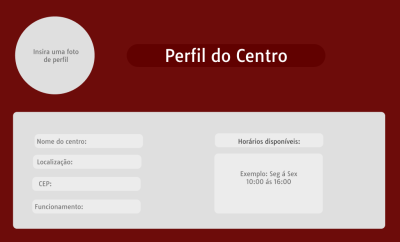
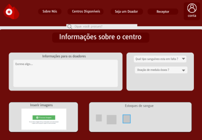
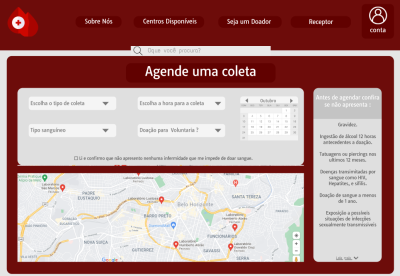
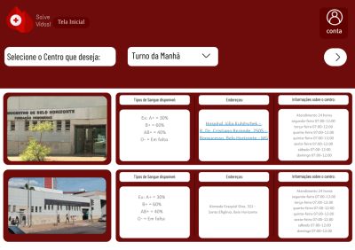
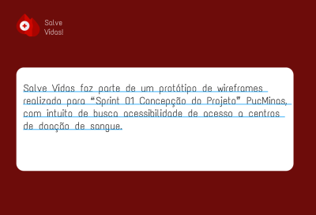

# Projeto de Interface

## User Flow

> Como podemos ver o usuário tem uma passagem clara até o agendamento de sua coleta, o mesmo se equivala para centros ainda não disponíveis em nosso cadastro, dão acesso geral a banco disponível de sangue, agendamento de usuários e horários de funcionamento.
>
> **Protótipo**:
> - [User Flow - Completo como um protótipo](https://www.figma.com/proto/4ffq1mb2qRNtL5FlDXU6kJ/Prot%C3%B3tipo-Doa%C3%A7%C3%A3o-Sangue?node-id=64%3A342&scaling=min-zoom&page-id=64%3A341&starting-point-node-id=64%3A342)

## Wireframes

 

 

> Todas as wireframes usadas para produzir o protótipo.
> 
> **Wireframes/Ferramenta**:
> - [Ferramenta Utilizada: Figma](https://www.figma.com)
> - [Wireframes Completos no Figma](https://www.figma.com/file/4ffq1mb2qRNtL5FlDXU6kJ/Protótipo-Doação-Sangue?node-id=0%3A1)
