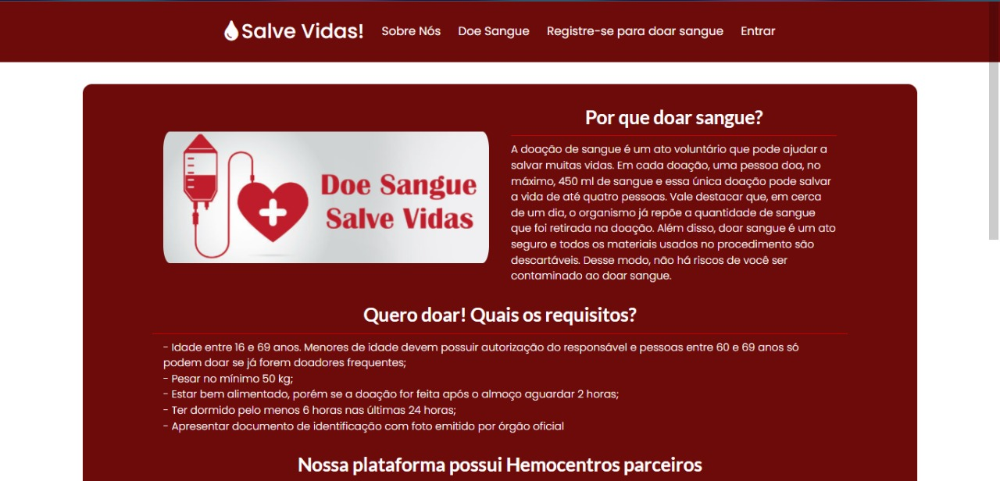
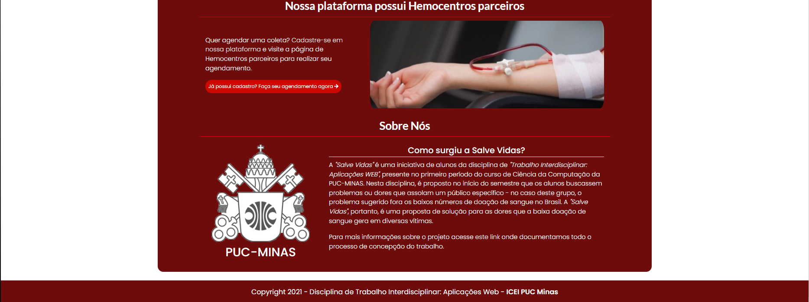
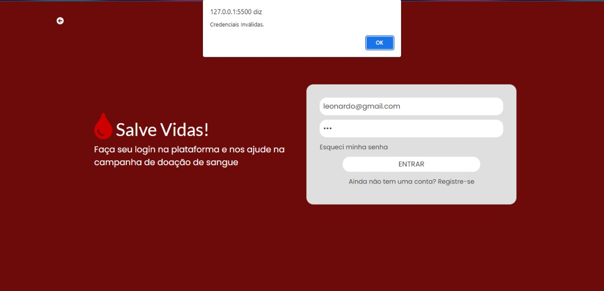
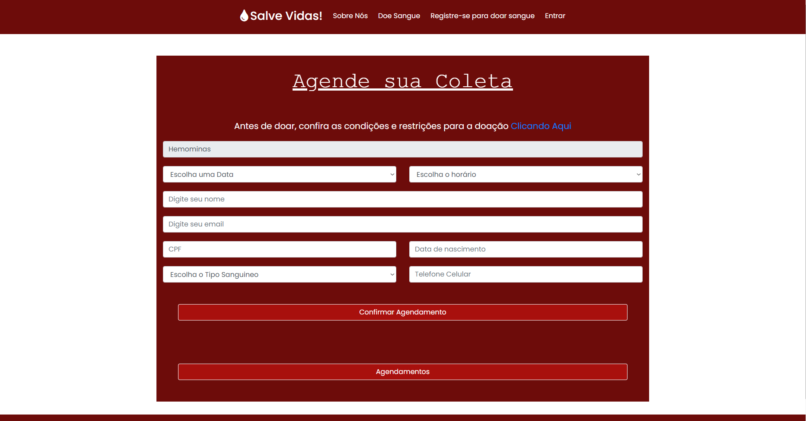
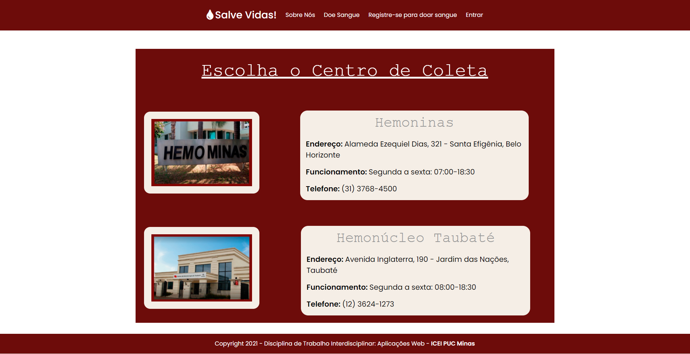

# Projeto da Solução

## Tecnologias Utilizadas

> Em começo o "Desenho" anterior para observação do possível Userflow de nosso projeto foi estabelicido em Adobe Illustrador, logo após toda sua montagem foi utilizada pelo figma, wireframes e protótipo.

## Arquitetura da solução

>Primeiro contato do usuário é frame "Central" onde ele pode optar caso for um doador, se inscrever , assim levando para o frame 2 "Login do Usuário", caso não há um cadastro é direcionado para o frame "Cadastro", após o login/cadastro é destinado para uma pagina de centros dísponíveis aonde ele seleciona o mais perto de sua casa ou de sua preferência frame "Seletor de centro do usuário doador", e em seguida é destinado para o agendamento do horário e dia frame "Agenda de coleta para o usuário".Temos também um frame dedicado a um receptor que esteja precisando de um tipo sanguinio e assim poderá ver estado de bancos de sangue de cada centro "Seletor de centro do usuário receptor" e logo depois poder agendar, frame "agenda do centro para receptor".
  Caso seja um centro que deseja ser acessado pelo nosso sistema é direcionado para um outro frame de cadastro,frame "Cadastro de informação centro", e logo após terá acesso de uma agenda onde poderá editar suas informações de funcionamento e pedidos de agendamento do usuário,frame "Agendamento do centro".

## Tela Home

### Tela Sobre nós

### Tela de Login

### Tela de Cadastro

### Tela de Agendamento

### Tela de Centro
