# Avaliação da Aplicação

## Plano de Testes

> Ao juntar das sprints colocadas, fizemos testes para á junção e ajuste de compatibilidade, como: Login,retorno na pagina inicial,cadastro de informação,senhas incorretas.

## Registro de Testes

> 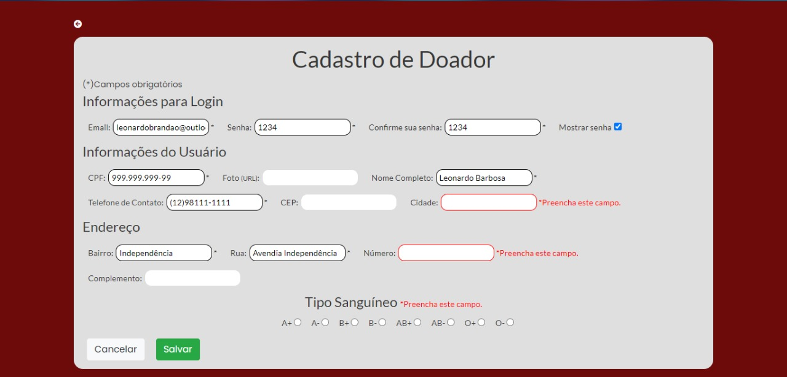
> 
> 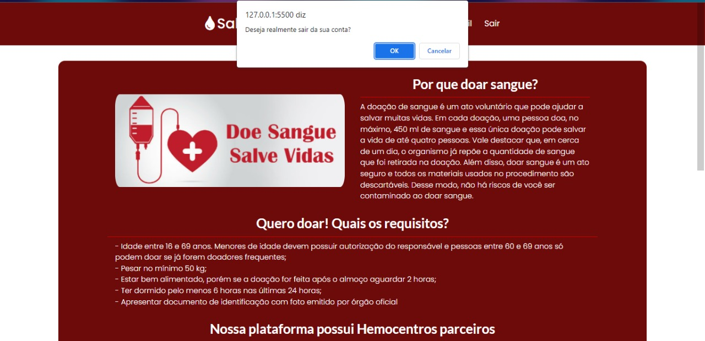
> 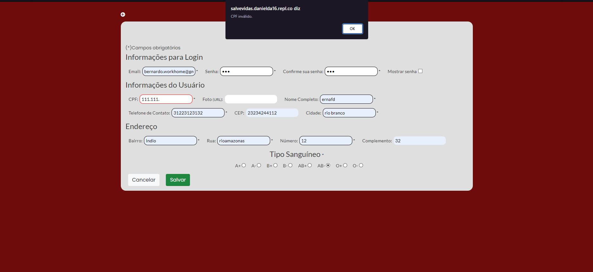
> 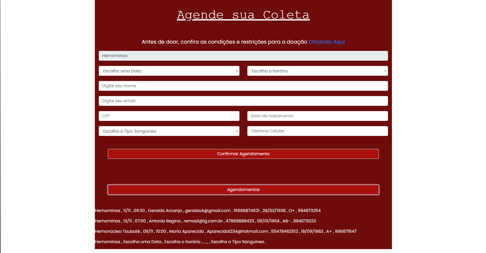

## Plano de Testes Softwares
> Após o inicio da sprint 04, tivemos incompativilidades para mesclar todas as telas, como: Login,retorno na pagina inicial,cadastro de informação,senhas incorretas.
## Registro de Teste Softwares

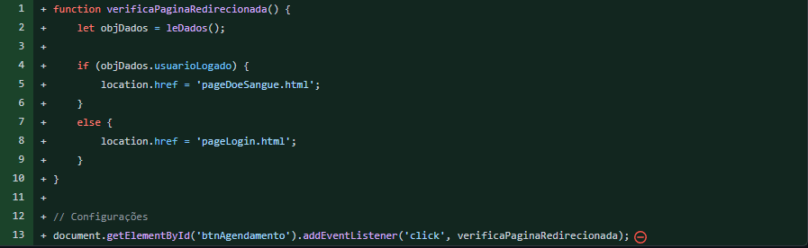

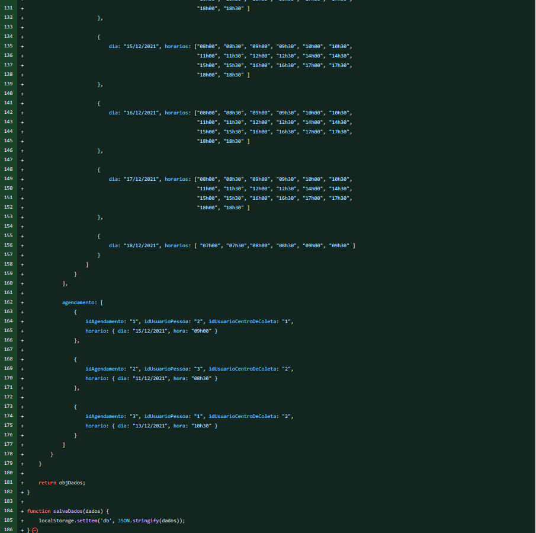
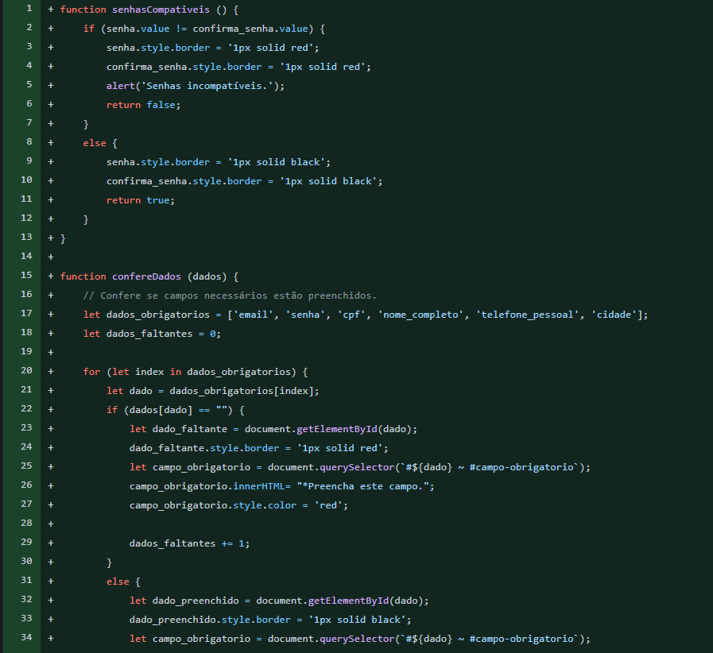
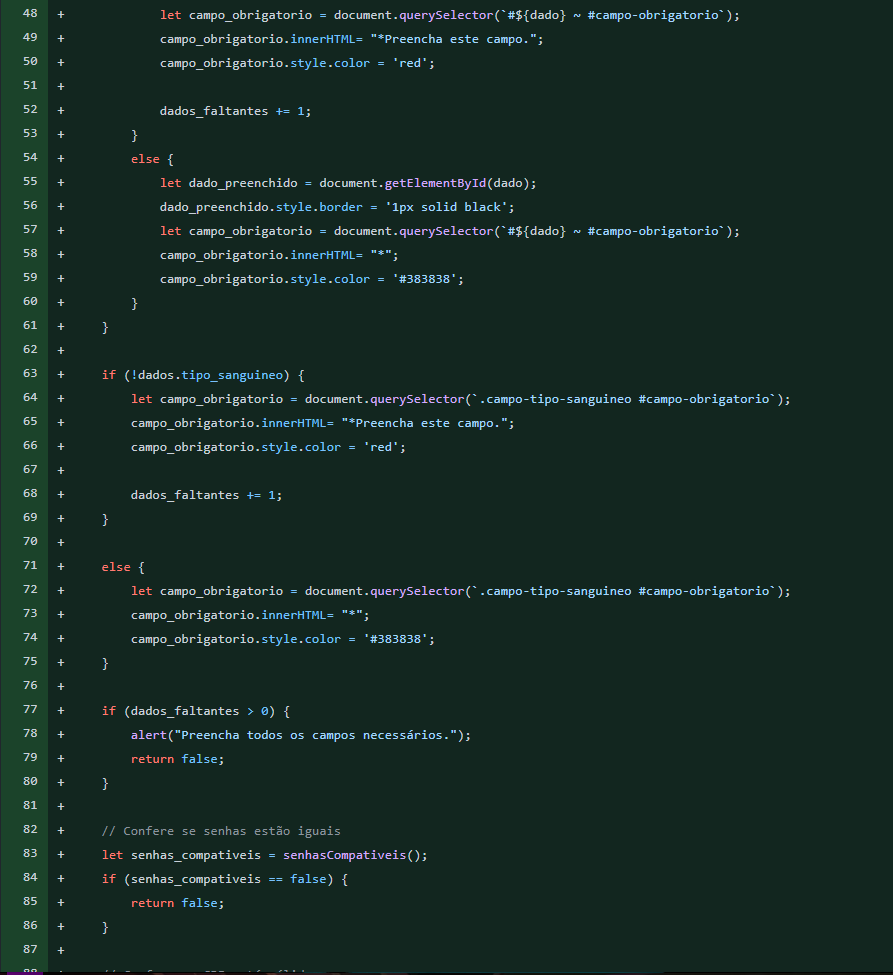
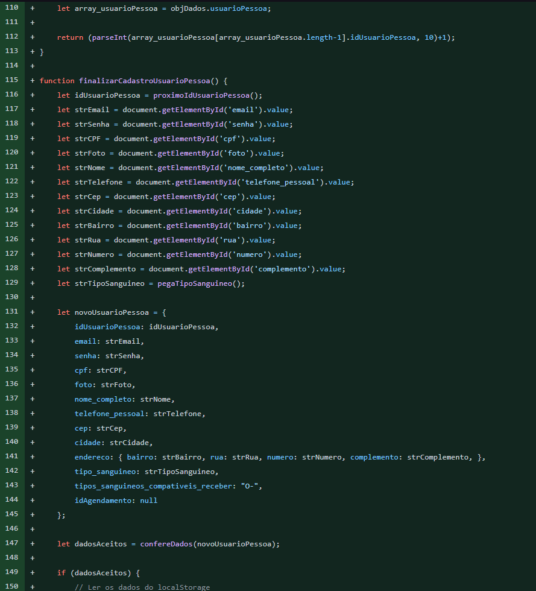
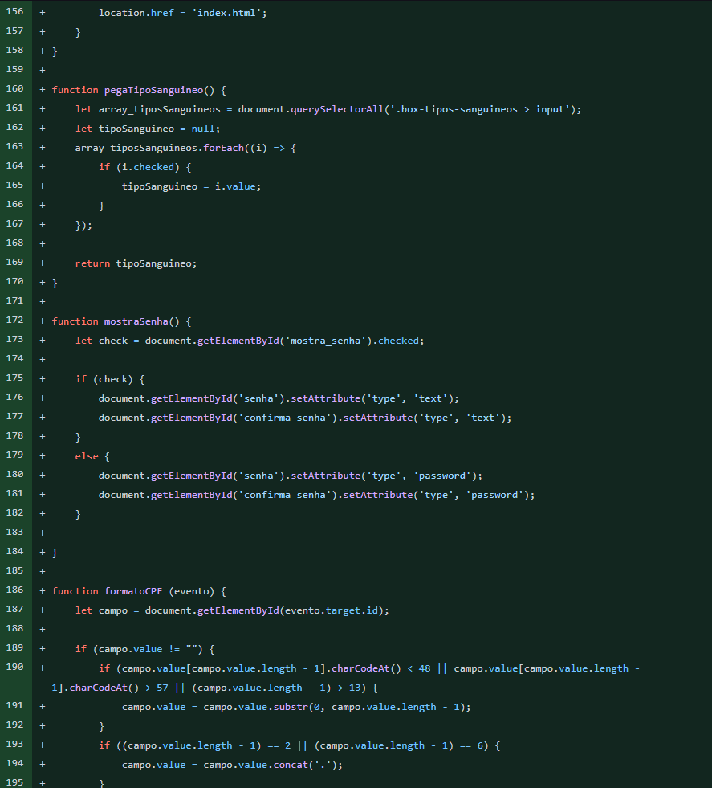
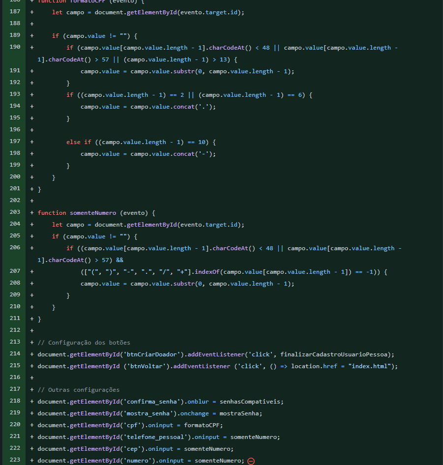

## Avaliação

> Creio que tivems bastante acertos em como pensamos na ideias e de como implementar, uma fraqueza que tivemos e que pode perpetuar é a divulgação pois mesmo com campanhas ainda é muito fraco para que as pessoas procurem acessar sites deste tipo, talvez á melhor solução seja de centros apoiarem cadastros como um "perfil hospitalar" e talvez devemos ter refinado mais os wireframes deixando um pouco mais específico cada função.
>  Baseado na conclusão do projeto, percebemos que a integração de uma plataforma como essa tem muito a oferecer para os doadores e centros de coleta,
> pois ela junta todas as informações e detalhes em apenas um lugar. Entretanto, ainda se tem como dificuldade a propagação dessa ferramenta para o uso,
> visto que muitos centros de coleta tem seus próprios sites e ferramentas. Sendo assim, a divulgação dessa ferramenta como uma melhora para os centros
> ainda precisa ser aprofundada e melhorada para que se tenha um aumento na performace nas próximas interações.

